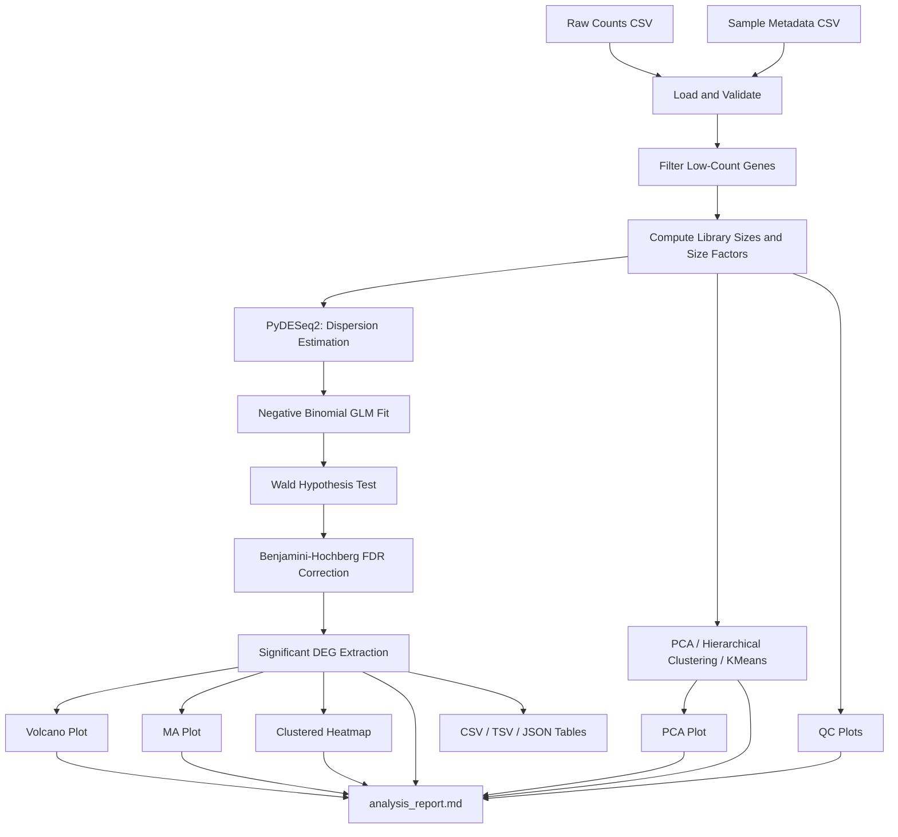

# Arabidopsis RNA-seq Transcriptomic Analysis

**Transcriptomic analysis of public RNA-seq data using statistical and machine-learning methods.**

An end-to-end, command-line differential gene expression (DGE) pipeline for *Arabidopsis thaliana* RNA-seq count data, built around [PyDESeq2](https://github.com/owkin/PyDESeq2) (the Python port of DESeq2's negative-binomial modeling framework), with supporting unsupervised machine-learning analysis and publication-quality visualization.

---

## Table of Contents

- [Overview](#overview)
- [Motivation](#motivation)
- [Background: What Is RNA-seq DGE Analysis?](#background-what-is-rna-seq-dge-analysis)
- [Why *Arabidopsis thaliana*?](#why-arabidopsis-thaliana)
- [Pipeline Architecture](#pipeline-architecture)
- [Repository Structure](#repository-structure)
- [Installation](#installation)
- [Usage](#usage)
- [Statistical Methods](#statistical-methods)
- [Machine Learning Components](#machine-learning-components)
- [Outputs](#outputs)
- [Dataset](#dataset)
- [Results Interpretation](#results-interpretation)
- [Limitations](#limitations)
- [Future Work](#future-work)
- [Testing](#testing)
- [References](#references)
- [Citation](#citation)
- [License](#license)
- [Acknowledgements](#acknowledgements)

---

## Overview

This repository implements a complete, reproducible RNA-seq differential gene expression pipeline: raw count loading → validation → filtering → normalization → DESeq2-style statistical modeling → significance testing → unsupervised ML cross-checks → publication-ready figures → automated reporting.

It targets abiotic stress response studies in *Arabidopsis thaliana*, but the pipeline itself is dataset-agnostic — any two-condition (or extendable multi-condition) raw count matrix with matching sample metadata can be analyzed.

Every claim made about this pipeline's capabilities is backed by functioning, tested code in `src/rnaseq/`. Nothing here is a tutorial stub — modules raise real validation errors, PyDESeq2 performs a real negative-binomial GLM fit with Wald testing and BH correction, and figures are generated from real computed statistics.

## Motivation

Public RNA-seq repositories (GEO, SRA, ArrayExpress) contain thousands of plant stress-response datasets, but going from a raw count matrix to a defensible list of differentially expressed genes requires correctly chaining together normalization, dispersion modeling, hypothesis testing, and multiple-testing correction — each step has failure modes that silently produce wrong results if skipped or done naively (e.g., comparing raw counts across samples with different sequencing depth, or using a t-test where an NB-GLM Wald test is appropriate).

This project was built to implement that chain correctly, transparently, and reproducibly — as a foundation for research-internship-level computational biology work.

## Background: What Is RNA-seq DGE Analysis?

RNA sequencing measures transcript abundance genome-wide. After reads are aligned and summarized into a **gene × sample count matrix** (not performed by this repository — see [Dataset](#dataset)), differential expression analysis asks: *which genes' expression levels differ significantly between experimental conditions, beyond what's expected from normal biological and technical variability?*

Raw counts cannot be compared directly across samples because:
- **Sequencing depth (library size)** varies between samples — a sample sequenced twice as deeply will have roughly double the counts for every gene, condition aside.
- **Count variance scales with the mean** in a way that isn't well captured by a normal distribution — RNA-seq counts are overdispersed relative to a Poisson model, which is why DESeq2 models them as **negative binomial**.

The DESeq2 methodology (Love, Huber & Anders, 2014), implemented here via PyDESeq2, addresses this with:
1. **Median-of-ratios normalization** — robust per-sample size factors.
2. **Per-gene dispersion estimation** — shrunk toward a fitted mean-dispersion trend, stabilizing estimates for genes/experiments with few replicates.
3. **Negative binomial GLM fit** per gene, with a **Wald test** on the log2 fold-change coefficient.
4. **Benjamini-Hochberg FDR correction** across all tested genes, since testing thousands of genes simultaneously inflates the false-positive rate if uncorrected.

## Why *Arabidopsis thaliana*?

*Arabidopsis thaliana* is the standard model organism in plant molecular biology: a small, fully sequenced, well-annotated genome, short generation time, and a vast public RNA-seq literature on abiotic stress responses (drought, salinity, heat, cold). This makes it an ideal system for demonstrating a DGE pipeline with genuine biological relevance and readily available public data for validation.

## Pipeline Architecture



## Repository Structure

```
arabidopsis-rnaseq-transcriptomic-analysis/
├── data/
│   ├── raw/                      # user-supplied real count matrices
│   ├── processed/                # pipeline intermediates
│   ├── metadata/                 # sample sheets
│   └── example_dataset/          # bundled synthetic dataset (see Dataset section)
│
├── notebooks/
│   ├── 01_data_loading.ipynb
│   ├── 02_preprocessing.ipynb
│   ├── 03_deseq2_analysis.ipynb
│   ├── 04_visualization.ipynb
│   └── 05_biological_interpretation.ipynb
│
├── src/rnaseq/                   # installable package
│   ├── config.py                 # PipelineConfig dataclass
│   ├── logging_utils.py          # centralized logging
│   ├── io.py                     # load + validate counts/metadata
│   ├── preprocessing.py          # filtering, size factors, normalization
│   ├── deseq_pipeline.py         # PyDESeq2 wrapper
│   ├── statistics.py             # DEG extraction, correlation, summaries
│   ├── report.py                 # analysis_report.md + CSV/TSV/JSON export
│   ├── ml/
│   │   ├── pca.py
│   │   ├── clustering.py         # hierarchical + KMeans
│   │   └── dimensionality.py     # optional t-SNE comparison
│   └── viz/
│       ├── style.py
│       ├── volcano.py
│       ├── ma_plot.py
│       ├── heatmap.py
│       ├── pca_plot.py
│       └── qc_plots.py
│
├── scripts/
│   └── generate_example_dataset.py
│
├── outputs/
│   ├── figures/{png,pdf}/
│   ├── tables/
│   ├── reports/
│   └── logs/
│
├── tests/
├── docs/
│   ├── index.html
│   └── DATASET.md
├── main.py
├── requirements.txt
├── environment.yml
├── LICENSE
└── .gitignore
```

## Installation

**Requirements:** Python 3.10+

```bash
git clone https://github.com/<your-username>/arabidopsis-rnaseq-transcriptomic-analysis.git
cd arabidopsis-rnaseq-transcriptomic-analysis

python -m venv .venv
source .venv/bin/activate        # Windows: .venv\Scripts\activate

pip install -r requirements.txt
```

Or with conda:

```bash
conda env create -f environment.yml
conda activate rnaseq-arabidopsis
```

## Usage

Generate the bundled synthetic example dataset (optional — one is already committed under `data/example_dataset/`):

```bash
python scripts/generate_example_dataset.py --n-genes 2000 --n-control 4 --n-stress 4 \
    --out-dir data/example_dataset
```

Run the full pipeline:

```bash
python main.py \
    --counts data/example_dataset/counts.csv \
    --metadata data/example_dataset/metadata.csv \
    --condition-column condition \
    --reference-level control \
    --output outputs/
```

Key CLI options:

| Flag | Description | Default |
|---|---|---|
| `--counts` | Path to gene × sample raw count matrix | required |
| `--metadata` | Path to sample metadata table | required |
| `--output` | Output directory root | `outputs/` |
| `--condition-column` | Metadata column used as DE design factor | `condition` |
| `--reference-level` | Baseline condition for the Wald contrast | `control` |
| `--alpha` | FDR significance threshold | `0.05` |
| `--lfc-threshold` | Minimum \|log2FC\| for the "significant" gene set | `1.0` |
| `--min-total-count` | Minimum total raw count for gene filtering | `10` |
| `--kmeans-k` | Number of KMeans clusters | `2` |

All outputs are written under `<output>/{figures,tables,reports,logs}/`.

## Statistical Methods

| Step | Method |
|---|---|
| Normalization | Median-of-ratios size factors (DESeq2 methodology) |
| Dispersion estimation | Gene-wise → trend curve → MAP shrinkage (PyDESeq2) |
| Model | Negative binomial generalized linear model |
| Hypothesis test | Wald test on the fitted log2 fold-change coefficient |
| Multiple testing correction | Benjamini-Hochberg FDR |
| Significance criteria | `padj < alpha` **and** `\|log2FoldChange\| >= lfc_threshold` |

## Machine Learning Components

- **Principal Component Analysis (PCA)** — computed on the top-variance-gene expression matrix (log2-scale); mandatory sample-level QC/exploration step.
- **Hierarchical clustering** — Ward linkage, Euclidean distance, on the same matrix as PCA.
- **KMeans clustering** — cross-checked against true condition labels via **Adjusted Rand Index (ARI)**.
- **Optional t-SNE** — for qualitative comparison against PCA (gated behind `--run-dim-reduction-comparison`; perplexity auto-capped for small sample counts).

These are complementary sanity checks, not replacements for the DESeq2 statistical test — the significance calls always come from the Wald test + BH correction, never from clustering.

## Outputs

**Figures** (`outputs/figures/{png,pdf}/`):
- `volcano_plot` — log2FC vs. -log10(padj), colored by significance/direction
- `ma_plot` — mean expression vs. log2FC
- `deg_heatmap` — clustered heatmap of top significant DEGs
- `pca_plot` — PC1 vs. PC2, colored by condition
- `library_sizes`, `normalization_boxplots`, `expression_distribution`, `sample_correlation` — QC plots

**Tables** (`outputs/tables/`):
- `deseq2_full_results.csv` — all tested genes
- `significant_degs.csv` / `.tsv` — genes passing the significance filter
- `upregulated_genes.csv`, `downregulated_genes.csv`
- `normalized_counts.csv`, `sample_correlation_matrix.csv`
- `significant_gene_ids.json`

**Reports** (`outputs/reports/`):
- `analysis_report.md` — full narrative report (every figure/number generated live from the run, not hardcoded)
- `run_config.json` — exact configuration used for the run (reproducibility)

## Dataset

The repository ships a small **synthetic** example dataset (`data/example_dataset/`), generated by `scripts/generate_example_dataset.py` using a negative-binomial simulation with a seeded ground-truth DEG set. It exists purely so the pipeline runs immediately after cloning with no external download or licensing concerns — it carries no biological meaning and is documented as such in `data/example_dataset/README.md`.

For real analysis, use a public *Arabidopsis thaliana* abiotic-stress RNA-seq count dataset (e.g., an NCBI GEO series with an available raw count matrix). See `docs/DATASET.md` for source, citation, licensing, and download instructions — raw data is **not redistributed** in this repository.

## Results Interpretation

The pipeline outputs a statistically validated list of candidate differentially expressed genes (via Wald test + BH correction), plus unsupervised confirmation (PCA/clustering) that the discovered structure aligns with the known experimental groups. Interpreting *which biological pathways* these genes belong to requires cross-referencing gene IDs against a functional annotation resource such as TAIR or Ensembl Plants — gene ontology / pathway enrichment is not performed automatically by this pipeline (see Limitations).

## Limitations

- No GO-term or KEGG pathway enrichment is performed; DEG lists are statistical outputs requiring external biological annotation.
- Small replicate counts (common in public datasets) widen fold-change confidence intervals.
- t-SNE, if enabled, has no principled variance-explained interpretation.
- The current design formula (`~condition`) does not model batch effects unless added as an explicit metadata covariate.
- Read alignment/quantification (FASTQ → count matrix) is out of scope; this pipeline starts from an already-quantified count matrix.

## Future Work

- GO-term / KEGG pathway enrichment on significant DEGs
- Multi-factor design support (e.g. `~batch + condition`) and interaction contrasts
- Automatic outlier-sample detection prior to model fitting
- Time-course RNA-seq support (likelihood ratio test workflows)
- Default integration of a real public GEO/SRA dataset with automated download

## Testing

```bash
pytest tests/ -v
```

Covers core utility functions (I/O validation, preprocessing math, DESeq2 wrapper contract, statistics extraction) against small synthetic fixtures.

## References

- Love, M.I., Huber, W., Anders, S. (2014). Moderated estimation of fold change and dispersion for RNA-seq data with DESeq2. *Genome Biology*, 15, 550.
- Muzellec, B., Teleńczuk, M., Cabeli, V., Andreux, M. (2023). PyDESeq2: a python package for bulk RNA-seq differential expression analysis. *Bioinformatics*.
- Benjamini, Y., Hochberg, Y. (1995). Controlling the false discovery rate. *Journal of the Royal Statistical Society B*, 57(1), 289-300.

## Citation

If you use this pipeline, please cite the repository and the underlying PyDESeq2/DESeq2 methodology referenced above.

## License

MIT License — see `LICENSE`.

## Acknowledgements

Built on the open-source scientific Python ecosystem: PyDESeq2, pandas, NumPy, scikit-learn, SciPy, statsmodels, matplotlib, seaborn.
